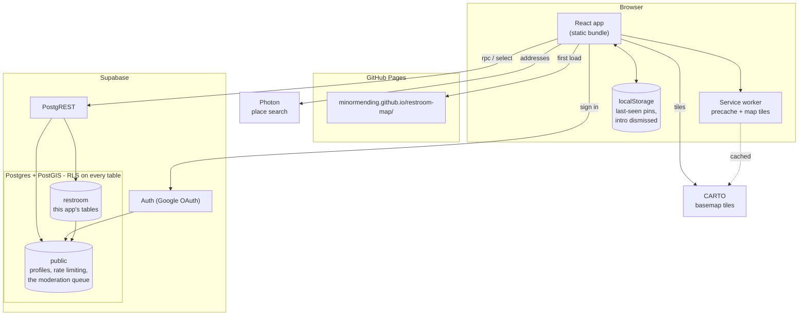
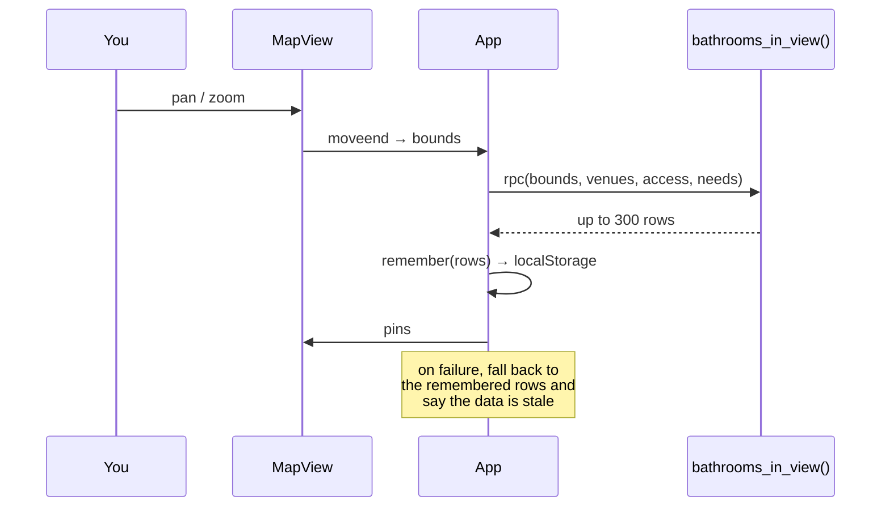
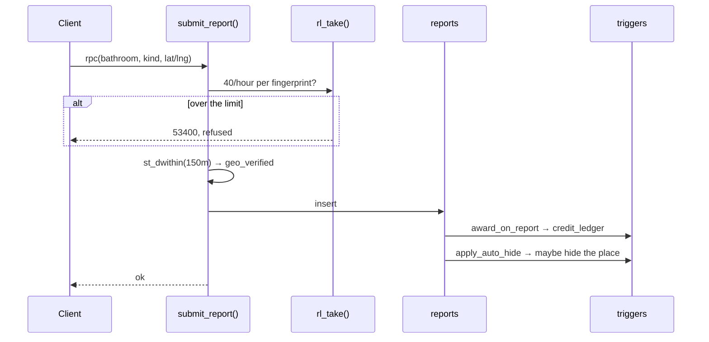
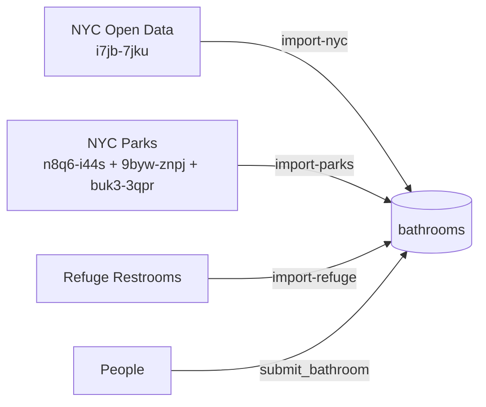
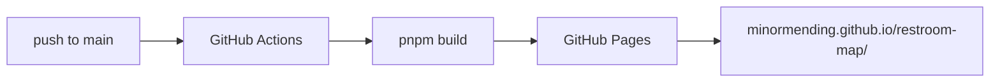

# Architecture

## The shape of it

There is no server. A static bundle on GitHub Pages talks straight to Postgres
through Supabase, and every rule lives in the database.

That database is shared with other apps. This one owns the `restroom` schema,
over a `public` layer holding accounts, rate limiting and the moderation queue
— see [shared-database.md](shared-database.md), which is the newest and least
obvious thing here.

Three things follow from having no server, and they explain most of the
decisions in this repo:

1. **The anon key is public.** It is in the bundle. It identifies the project
   and authorises nothing — every restriction is a row-level security policy or
   a function grant. See [security.md](security.md).
2. **There is nowhere to put a secret.** Door codes are gated by a database
   function, not by hiding them in the client.
3. **The client cannot be trusted to enforce anything.** Rate limits, duplicate
   checks and "were you actually there" all run in Postgres.

## How a read works

Opening the map is one call.

`bathrooms_in_view` is one function doing the filtering in SQL rather than
fetching everything and filtering in JavaScript. It returns a **maximum of 300
rows**, which is why the banner says "300+ places in view" rather than a count
when it hits the cap — stating a limit as a total would be a lie.

<b>Advanced</b> — the signature is a public API

PostgREST resolves functions by **argument name**, so the signature is part of
the contract with every deployed bundle, including the one in somebody's
service worker cache from last week.

This has already caused an outage. Dropping the old signature while adding a
parameter took the live site down for about fifteen minutes: every viewport
query 404ed because the deployed client was still calling the previous shape.
The fix was to ship the client immediately; the lesson is that adding a
parameter with a default is safe and **removing or renaming one is not**.

Adding a returned *column* is also a signature change — it changes the return
type, which means a `drop` rather than a `create or replace`. Where a new field
is only needed for filtering, reference it in the `where` clause and do not
return it. `closed_in_winter` is done exactly that way.

## How a write works

Every write goes through a `security definer` function. None of them are
optional conveniences — they are the only door, because the tables carry no
write grants.

The client sends coordinates; **the server does not store them.** It computes a
single yes/no — were you within about 150 metres — records that boolean, and
discards the position. There is no column anywhere holding where anybody was.

<b>Advanced</b> — the full set of entry points

| function | who may call it | limit |
| --- | --- | --- |
| `submit_bathroom` | authenticated | 5/day, plus a 20m duplicate refusal |
| `submit_code` | authenticated | supersedes the previous code |
| `submit_report` | anon + authenticated | 40/hour per address, plus per-place |
| `submit_access_claim` | authenticated | 60/hour |
| `unlock_code` | authenticated | costs 2 credits |
| `get_code` | anon + authenticated | returns `locked` rather than the code |
| `bathrooms_in_view` | anon + authenticated | 300 rows |
| `public.submit_flag` | anon + authenticated | 10/day |
| `public.submit_feedback` | anon + authenticated | 5/day |

The last two are **shared**: they live in `public`, serve every app in the
database, and take a `p_app` naming the caller. Everything above them is this
app's, in `restroom`. A client reaches a shared one with
`supabase.schema('public').rpc(…)`, because the default client is configured
for `restroom` and PostgREST does not fall back —
[shared-database.md](shared-database.md) has the rest, including the two
callers that currently get this wrong.

`client_fingerprint()` and `rl_take()` are revoked from everybody but the
owner, so a client cannot read or spend somebody else's bucket. The
fingerprint is a salted one-way hash of the request IP; the salt lives in a
function the API roles cannot execute. All three are in the shared layer now,
which makes the bucket **key** worth a look: the shared functions namespace
theirs (`restroom-map:feedback:<fingerprint>`), and this app's own functions do
not (`ip:`, `claim:`, `rpt:`). Unprefixed keys sit in one table with every other
app's, so a second app using the same convention would share the bucket. Give a
new one an app-prefixed key.

## Where the data came from

Every imported row records `import_source`, `import_id` and `import_licence`,
so withdrawing a source is one delete and the licence travels with the rows
rather than living in somebody's memory. All three sources declare **no
licence**, which is ambiguity rather than permission — the scripts say so above
the `--apply` flag.

Every importer is a dry run by default.

<b>Advanced</b> — what the Parks importer actually does

It is the interesting one, because it is mostly not about adding pins. The
park restrooms were already present from `i7jb-7jku`; 646 of the 715 comfort
stations Parks maps had a pin within 30m already.

What `i7jb-7jku` does not carry is how stale it is — last refreshed November
2025, against an inspection list refreshed weekly. So `import-parks.mjs` joins
three datasets (structures for location, inspections for status, property
polygons to tie them together) and its main output is **hiding** places NYC
Parks records as closed, un-hiding them when repairs end, and marking the ones
that shut for the winter.

Two rules in it are worth copying elsewhere:

- The join is property-level, because nothing published maps a comfort-station
  id to a point. A park with two stations where one is closed is genuinely
  ambiguous, so those are **printed for a person** rather than acted on.
- A confirmation from the last 90 days outranks the municipal record. Removing
  a place somebody just confirmed would teach people that confirming does
  nothing.

## Build and deploy

The bundle carries a build number: `git rev-list --count HEAD`, injected as
`__BUILD_ID__` and rendered as `v97` in the menu. It exists because **a hard
refresh does not defeat a service worker** — the worker still controls the
navigation and answers with what it has. So the page has to be able to say
which version it is, and the version tag is also the button that unregisters
every worker, drops every cache and reloads.

<b>Advanced</b> — the shallow-clone trap

`actions/checkout` clones with depth 1 by default, which makes
`git rev-list --count HEAD` return **1** for every build. That is worse than no
version at all: it looks like a version and never changes.

`deploy.yml` sets `fetch-depth: 0` for exactly this reason. The same trap is
live in the audit repo, whose `fetch-targets.js` clones targets shallow — which
is why the audit's baselines of this app show `v1`, and why the build tag is
hidden from its screenshots rather than compared.

