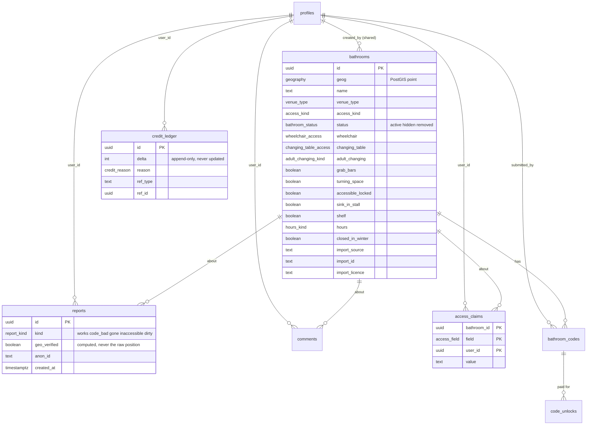
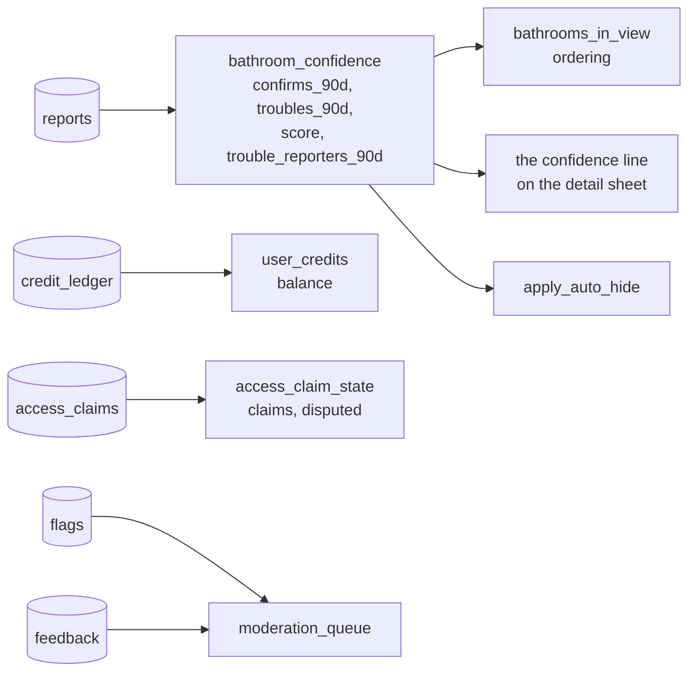

# Data model

Seven tables in this app's own schema, over six in the layer shared with the
other apps in the database. Four of the seven are the map; the rest are how it
earns the right to say anything.

Which is which matters when you go looking for one, so:

| in `restroom`, this app's | in `public`, shared |
| --- | --- |
| `bathrooms`, `bathroom_codes`, `reports`, `comments` | `profiles` |
| `access_claims`, `code_unlocks`, `credit_ledger` | `flags`, `feedback` |
| | `rate_limit`, `apps`, `moderators` |

[shared-database.md](shared-database.md) is why. The short version is that
accounts, rate limiting and the moderation queue are one per database rather
than one per app, and everything below that names `profiles`, `flags`,
`feedback` or `rate_limit` is talking about a table this repo does not own.



Two of the shared tables have no relationship to anything, on purpose — and
being shared is now a second reason they could not have one:

- **`flags`** — a complaint about a row. `target_type` is `bathroom` or
  `comment` and `target_id` is **not** a foreign key, so a flag survives the
  thing it was about. That is the audit trail: deleting the evidence alongside
  the thing is how a deletion becomes unexplainable six months later. It could
  not be a foreign key now in any case, because the rows it points at are in a
  different app's schema depending on which app wrote it.
- **`feedback`** — a complaint about the app. No target at all, which is why it
  is not a flag.

Both carry an `app` column. **Every query against either needs to filter on
it**, or it is reading the whole database's complaints rather than this one's.

And **`rate_limit`** is just a counter keyed by a hashed address.

## The four that are the map

| table | what it holds |
| --- | --- |
| `bathrooms` | 27 columns. The place, where it is, and everything known about getting into it |
| `bathroom_codes` | door codes, superseded rather than updated, so history survives |
| `reports` | "it worked" / "it was gone" / "the code was wrong" |
| `comments` | free-text notes, the only table the client writes to directly |

### Why `bathrooms` is wide

Because the question the app asks is wide. Each of these is a separate column
rather than a JSON blob because each is independently filterable, independently
claimable, and independently *missing* — `null` means nobody has said, which is
different from `false`.

<details>
<summary><b>Advanced</b> — the enums, and why three of them are not booleans</summary>

```sql
wheelchair_access      full | partial | none
changing_table_access  any  | women_only | men_only | none
adult_changing_kind    changing_places | bench | none
hours_kind             always | daylight | venue
```

Flattening any of the first three is how somebody ends up outside a door they
cannot use.

- `partial` is its own answer, not a rounding. A partly accessible restroom is
  exactly the trip a wheelchair user cannot afford to waste, so the `step_free`
  filter requires `full` and excludes `partial`.
- `women_only` is a changing table somebody cannot use. Flattening it to "yes"
  sends a father with an infant to a table he cannot reach.
- `hours_kind` is coarse because two people have to **agree** before an answer
  is shown as fact, and "Mo-Fr 09:00-17:00" and "9am-5pm weekdays" are the same
  fact that would never agree as strings. Three coarse answers can.

`venue` never matches the "open now" filter, deliberately. The database does
not know the café's hours and guessing is how the wasted trip happens.

</details>

## Views

There are four, and they are where the reasoning lives.

| view | answers |
| --- | --- |
| `bathroom_confidence` | how much to believe a place, with time decay |
| `access_claim_state` | what people have claimed that is not yet settled |
| `user_credits` | a balance, summed from the ledger |
| `moderation_queue` | flags and feedback that are still open |



`user_credits` sums an **append-only ledger** rather than storing a balance.
There is no `update` on `credit_ledger` anywhere, so the balance cannot drift
from its history and a clawback is a negative row rather than an edit.

<details>
<summary><b>Advanced</b> — the confidence score decays</summary>

```sql
sum(
  case when kind = 'works' then 1.0 else -2.0 end
  * exp(-extract(epoch from now() - created_at) / 2592000.0)
)
```

Trouble counts double, and everything decays with a thirty-day half-life
(2592000 seconds). A place confirmed a year ago and reported broken yesterday
scores badly; a place reported broken a year ago and confirmed since recovers.

`trouble_reporters_90d` counts **distinct** reporters, not reports, which is
the number auto-hide actually uses — see [trust.md](trust.md). One person with
a grudge and a toggle is two addresses; three separate people is a signal.

`moderation_queue` is a `union all` of flags and feedback with matching column
names and types, so `pnpm db:queue` and the weekday check needed no edit when
feedback arrived. Feedback rows put the kind and build in the subject
(`feedback: bug · v97`), which is what you want to see before reading the
message.

It now does two more jobs, both invisible from the outside. It selects from the
**shared** `flags` and `feedback` with `where app = 'restroom-map'` on each half
of the union, so the queue is this app's and not the database's; and it aliases
the shared `message` column back to `reason`, which is the name every caller in
this repo already used. Those two lines are the reason `pnpm db:queue` survived
the move to a shared database without an edit — and `db.mjs triage`, which
queries the base tables instead of going through the view, did not.

</details>

## Migrations

Thirty-three files in `supabase/migrations/`, applied in filename order,
tracked in `schema_migrations` by hash. **Never edit one that has been
applied** — the hash check will refuse it. Add another.

The three numbered `0001`–`0003` are the odd ones out and they are the newest:
they create the `restroom` schema, carry every table into it, and move this
app's flags and feedback into the shared tables. They sort first because the
naming convention changed with them, which is harmless — they are recorded as
applied and nothing reapplies them — but it does mean the file order is no
longer the historical order. `schema_migrations` lives in `restroom` too, so
each app in the database numbers from `0001` without colliding.

They are worth reading in order; each one's header explains the failure or
decision that produced it, and several are more useful than this document.

<details>
<summary><b>Advanced</b> — two Postgres traps this schema has already hit</summary>

**`alter type … add value` cannot be used as a literal in the same
transaction.** Migration 020 adds `'hours'` to the `access_field` enum and then
has to compare `NEW.field::text = 'hours'` rather than using the enum literal,
because the new value is not visible to the statement that adds it.

**`create or replace view` cannot change a column's type**, including its
precision. Adding feedback to `moderation_queue` failed with *"cannot change
data type of view column score from numeric(6,2) to numeric"* — the union's
`null::numeric` had to be `null::numeric(6,2)` to match the existing column
exactly.

</details>
