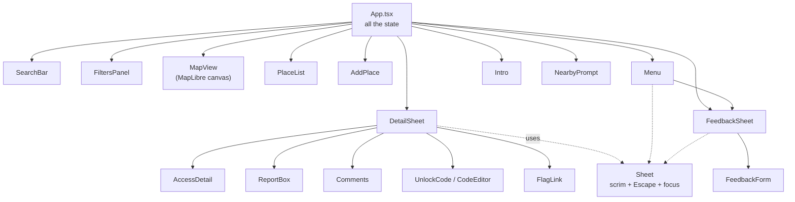
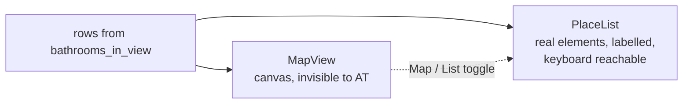
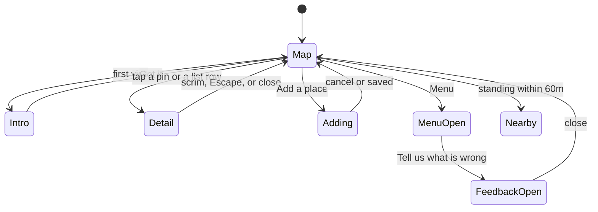

# The front end

React 19, TypeScript, Vite. No router, no state library — one `App.tsx` holding
state and passing it down. That is a deliberate ceiling, not an oversight: the
app is one screen with things layered over it.

## The one thing to understand: the map is a canvas

MapLibre draws pins into a `<canvas>`. A canvas has **nothing in it** for a
screen reader — no elements, no labels, no focus. So for a long time somebody
using a screen reader could open this app, apply filters, and be handed
absolutely nothing, on a project positioned on accessibility.

That is why `PlaceList` exists. It is not a preference or a nice-to-have; it is
the access route.

Everything the map can do, the list can do. If you add something to one, check
the other.

<b>Advanced</b> — pins, icons and the 81 images

Pin appearance encodes two independent things, which is why there are so many:

- **hue** = access kind (open, code required, ask staff, customers only)
- **fill** = whether anybody has confirmed it

A confirmed pin is solid; an unconfirmed one is drawn twice — a pale tint body,
then the same path stroked in the access colour. That keeps "nobody has
confirmed this" visible without letting grey overwrite the colour that says how
you get in. `pinIconId(venue, access, confirmed)` produces 81 registered
images.

They are generated as SVG at 64×88 and registered with `pixelRatio: 2`, so they
render at **32×44 CSS px** — narrower than the 44px touch guideline, which is
tolerable only because the map zooms.

`icon-allow-overlap: true` on both layers, because a pin that disappears at
certain zooms is a place somebody cannot tap.

The map runs its worker with `{ type: 'module' }`, which is why `vite.config.ts`
sets `worker: { format: 'es' }`.

## State lives in App.tsx

There is a lot of `useState` in one file. Before you reach for a state library,
note what most of it is: **one flag per layered thing**, because only one can
sensibly be in front of you at a time.

The render conditions encode that exclusivity directly, e.g. the nearby prompt
is `{standingAt && !intro && !selected && !adding && !profileOpen && …}`. It
reads as a pile of negations because it is one: nothing should interrupt
somebody who already has a sheet open.

<b>Advanced</b> — the data layer and its two fallbacks

[`src/lib/data.ts`](../src/lib/data.ts) owns every read. Two things in it are
easy to break:

**The `.select(…)` string must stay a single literal.** Split it across
concatenated pieces and supabase-js loses row-type inference, and the whole
detail payload silently becomes `any`.

**`meetsNeed` mirrors the SQL clause for clause.** The viewport RPC filters in
Postgres; the same filtering runs client-side against remembered rows when the
network is gone. If you change one you must change the other, and the comments
in both say so. A past divergence: `unlocked` used `is not true` in SQL, which
admits nulls, so the filter matched everything — the rule written three lines
above it said "known to be unlocked, not merely not known to be locked".

**Offline:** `remember(rows)` writes the last viewport to localStorage;
`looksLikeNoSignal()` distinguishes "no network" from "the server answered with
an error". Only the first falls back to stale pins with a banner. Painting old
pins over a real outage would hide the one signal anybody has.

## Sheets, and the three ways out

Anything covering the screen gets a scrim, an Escape handler and a close
button. [`Sheet.tsx`](../src/components/Sheet.tsx) is that, in one place.

This exists because it was missing. The detail sheet shipped with a single
30px close ring, no scrim, no swipe and no Escape — on a phone, where the sheet
covers 72% of the screen and there is no Escape key. A mis-tapped pin left you
hunting a corner.

The scrim is **below 48rem only**. Wider, the sheet is a panel down the side and
the map beside it is still usable; dimming it would take something away to
solve a problem that is not there.

<b>Advanced</b> — focus, and why the container takes it

Each sheet focuses its own container (`tabIndex={-1}`), not its close button.
Landing on "Close details" as the first thing announced is a strange way to be
shown a place; the container is labelled, so it announces the name.

`DetailSheet` keeps its own copy of this rather than using `Sheet`, because it
refocuses when `bathroom.id` changes — tapping a second pin while the first is
open must re-announce — which is a different effect from focusing once on
mount.

**Touch targets.** Controls in a sheet clear 44px — `--touch`. That was not
free: they were 19–37px and nothing flagged them, because WCAG 2.2 AA asks 24
and they all cleared it. 24 is the accessibility floor; Apple asks 44 and
Android 48. The close ring keeps its 1.9rem look and grows a pseudo-element
instead — a 44px filled circle would be the heaviest thing in the header, and
"move" and "edit the code" are sized the same way, because both sit inline in
a sentence.

This read "every control in a sheet" for a while and was not true, twice. The
detail sheet was done first and the add-a-place sheet was missed entirely, at
37–39px, which was the contribution path; then `.code-form input` and
`.flag-form input` sat at 35px for another day, both in the detail sheet the
first pass had supposedly finished. Both now take `min-height: var(--touch)`
from the same rule as the textarea beside them. The claim is true as written
today — which is exactly how it read on the two days it was false, so measure
before repeating it.

## CSS: one file, named bands

[`src/styles.css`](../src/styles.css) is plain CSS with custom properties. Four
of those properties are worth knowing because they encode relationships
between elements that live hundreds of lines apart:

| token | what it means |
| --- | --- |
| `--touch` | 2.75rem. The smallest a control may be when a thumb is the pointer |
| `--foot-band` | the strip along the bottom — legal links, version |
| `--above-foot` | where a card rising from the bottom must start to clear it |
| `--below-bar` | where floating overlays start, under the top bar |

They exist because hand-fitted numbers drifted. The intro card cleared the
footer by **four pixels** — measured, not overlapping, but a hairline that read
as a collision in a screenshot and would have become one with any change to the
footer's font size.

<b>Advanced</b> — two CSS traps this file has hit

**A sibling combinator that could never match.** `.sheet ~ .legal-links` was
written to hide the footer under an open sheet. `~` selects a *following*
sibling, and the footer is rendered *before* the sheet, so the rule was dead
from the day it was written. It is `.app:has(.sheet) .page-foot` now, which
asks the question the right way round.

**A flex column squashes its children.** `.sheet` is `display: flex;
flex-direction: column` with a max-height, so children shrink below their
content by default — and a child that shrinks does not scroll, it overlaps what
is next to it. The feedback form was the first thing tall enough to show it:
the heading, the form and the row below all landed on top of each other.
`.sheet > * { flex-shrink: 0 }` is the fix.

**Tinting a row changes what its text may be.** `--ink-3` is 4.77:1 on the
plain surface and **3.93:1** on `--accent-soft`. That caught a note and then
both labels of a form, twice in an hour, each time found by the audit rather
than by reading. The fill was removed rather than overridden a third time.

## Testing the UI

Visual, a11y, layout and console checks live in a separate repo (`ui-audit`)
and run against a build of this one: **144 checks — 12 registered states × 3
widths × 4 kinds.** Several of those states are only reachable through
deliberate setup — routed fixtures, a seeded session for the signed-in and
add-a-place screens, a fixed geolocation for the nearby prompt — because none
of them has a URL.

If you add a screen that is behind a click, a permission or a session, it has
no coverage until somebody registers it. That has already hidden two real
contrast failures, and later a 50px collision between the list and the top bar
that stayed green because no list state is registered at all.

**[testing.md](testing.md)** has the rest: what each check asserts, the three
`targets.json` keys that make this app reachable, and the two systems that do
not gate a merge.
