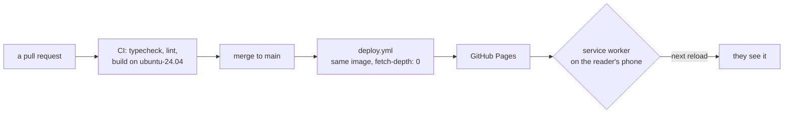
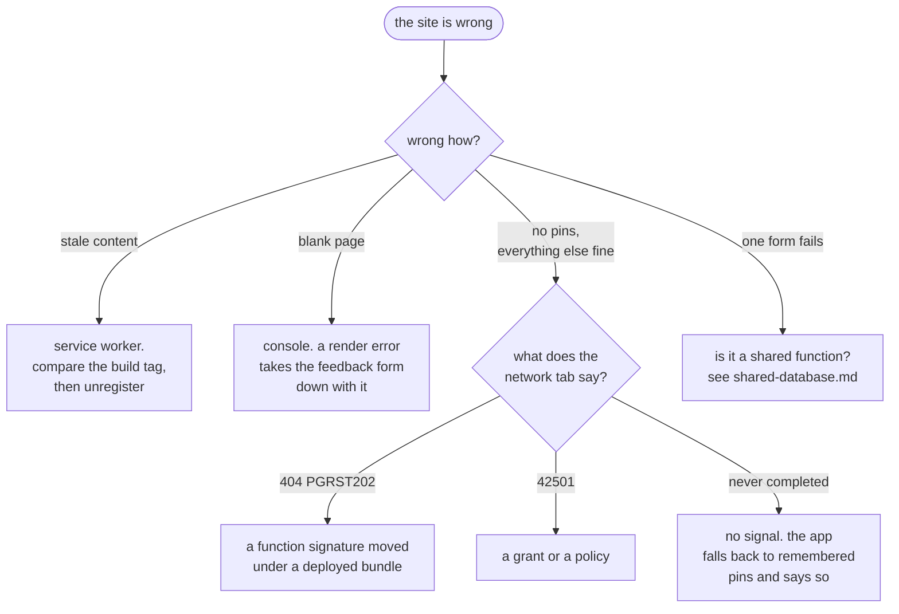

# Running it

There is no staging environment, no rollback button and one database. That
sounds alarming and mostly is not, because almost everything here is a static
file and the parts that are not are append-only. But it does mean a few
operations have an order, and doing them in the other order is how the site
went down for fifteen minutes.

## Deploying



Merging to `main` is the deploy. There is no other trigger except
`workflow_dispatch`, and that builds the head of `main` too — so **re-running
the workflow is not a rollback**. The rollback is a revert commit, reviewed and
merged like anything else.

Every change goes through a pull request. The `main` ruleset requires one and
requires `check` to pass, and it grants admin bypass — which is not permission
to use it. One merge per deploy is what makes a deploy traceable to a diff
afterwards.

| | typecheck | lint | build | the database suite |
| --- | --- | --- | --- | --- |
| `ci.yml`, on every PR | yes | yes | yes | **no** |
| `deploy.yml`, on merge | yes | no | yes | **no** |

`pnpm test` needs `SUPABASE_DB_PASSWORD`, which is full access that bypasses
RLS, so it is a local gate on purpose — see [testing.md](testing.md). If you
changed a Postgres function, nothing in CI will tell you.

## Knowing what is actually live

This is the first question in almost every confusing situation, and the app is
built to answer it: the menu shows a build tag, `v174` at the time of writing,
which is `git rev-list --count HEAD` at build time.

```bash
git rev-list --count origin/main                   # what main would build as
curl -s https://minormending.github.io/restroom-map/ | grep -o 'assets/index-[^"]*'
```

If the tag on the phone is lower than `origin/main`'s count, the reader has an
old bundle — almost always a service worker holding a precache. **A hard
refresh does not defeat a service worker**: it still controls the navigation
and answers with what it has. The version tag in the menu is also the button
that unregisters every worker, drops every cache and reloads, which is why it
is a button and not text.

<details>
<summary><b>Advanced</b> — the trap that makes the tag useless</summary>

`actions/checkout` clones with depth 1 by default, which makes
`git rev-list --count HEAD` return **1** on every build. That is worse than
having no version at all: it looks like a version and never changes.
`deploy.yml` sets `fetch-depth: 0` for exactly this reason, and the comment
above the line says so, so nobody tidies it away.

The same trap is live in the audit repo, whose fetcher clones targets shallow —
which is why the audit's baselines of this app show `v1`, and why the build tag
is hidden from its screenshots rather than compared.

</details>

## When something looks wrong



The **PGRST202** branch is the one with history. PostgREST resolves functions
by argument name, so a function's signature is part of the contract with every
deployed bundle — including the one sitting in somebody's service worker cache
from last week. Dropping the old signature while adding a parameter took the
live site down for about fifteen minutes: every viewport query 404ed, because
the deployed client was still calling the previous shape.

So, the order of operations that avoids it:

1. **Add a parameter with a default.** Never remove or rename one.
2. Ship the client that uses it.
3. Only then, much later, consider removing the old one — and read
   [architecture.md](architecture.md) before deciding that adding a returned
   *column* is safe, because it is not: it changes the return type, which means
   a `drop` rather than a `create or replace`.

## Migrations

```bash
pnpm db:status          # applied vs pending, and whether a file changed under you
pnpm db:migrate         # apply pending ones, each in its own transaction
node scripts/db.mjs migrate --baseline    # record as applied WITHOUT running
```

Thirty-three files, applied in filename order, tracked in `schema_migrations`
by filename and checksum. **Never edit one that has been applied** — the hash
check will refuse it, and it is right to. Add another.

Two things specific to this database being shared:

- `schema_migrations` lives in `restroom`, so this app's version numbers cannot
  collide with another app's. Every app in the database starts at `0001`.
- The shared layer in `public` is **not this repo's** and is not in
  `supabase/migrations/`. In a fresh database it has to be applied first,
  because `restroom` references `profiles`, `rate_limit` and `apps`. See
  [shared-database.md](shared-database.md).

## Moderation

```bash
pnpm db:queue                          # open items, anything awaiting a reply first
node scripts/db.mjs hide <id> "why"    # off the map immediately
node scripts/db.mjs unhide <id>        # put it back
node scripts/db.mjs resolve <id>       # mark an item dealt with
node scripts/db.mjs triage             # the same queue as JSON, for the daily run
```

Hiding is a soft delete: `status = 'hidden'`, and the place, its reports and its
notes all survive, so a mistaken or disputed takedown is reversible. The reason
goes on the row **and** a resolved flag is written, because a hidden place with
no record of why is unexplainable six months later.

`resolve` takes an id from the queue without needing to know whether it is a
flag or a piece of feedback — the queue does not say, and a person typing an id
should not have to care.

All five are covered by the `operator commands` suite now. They were not, for
the first year, and [testing.md](testing.md) has what that cost.

## Secrets, and which things are not secret

| | where | secret? |
| --- | --- | --- |
| `VITE_SUPABASE_URL`, `VITE_SUPABASE_ANON_KEY` | repository **variables** | no — public by design, baked into the bundle |
| `SUPABASE_DB_PASSWORD` | `.env`, gitignored | **yes** — full access, bypasses RLS entirely |

The anon key being public is the design, not a leak: it identifies the project
and authorises nothing. The database password is the opposite of that in every
respect, which is why it is in `.env`, why `.env` is gitignored, and why CI
does not have it.

<details>
<summary><b>Advanced</b> — known broken, as of 22 September 2026</summary>

Written down rather than left to be rediscovered. Each has a fuller account in
the document named.

- **The feedback form and the flag form do not work.** Both call a shared
  function through a client configured for `restroom`, and PostgREST does not
  fall back to `public`. Shipping since the schema move on 21 September.
  [shared-database.md](shared-database.md).
- **Every table in `restroom` carries `TRUNCATE` for `anon`**, from a generated
  grant list in migration 028. Not reachable through PostgREST, which never
  issues one, and still a privilege nobody decided to grant.
  [security.md](security.md).
- **The test canary's function-hash half watches `public`**, which is no longer
  where this app's functions are. [testing.md](testing.md).

</details>
