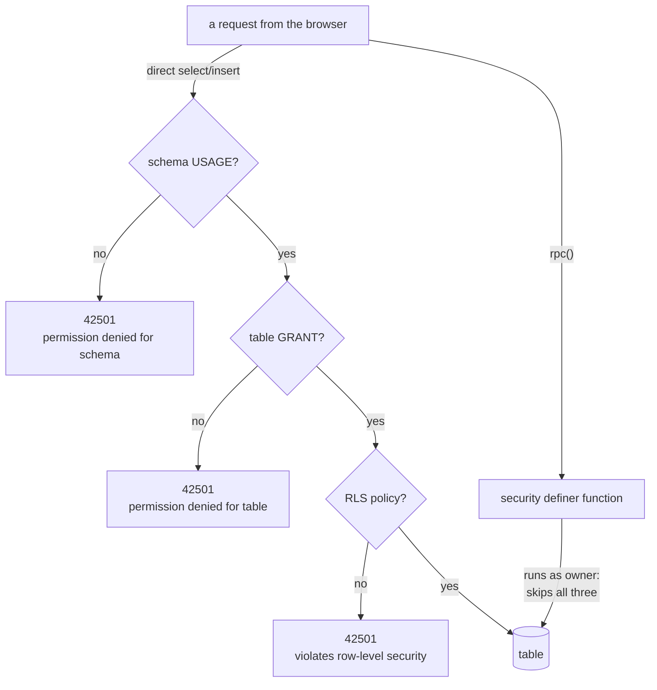
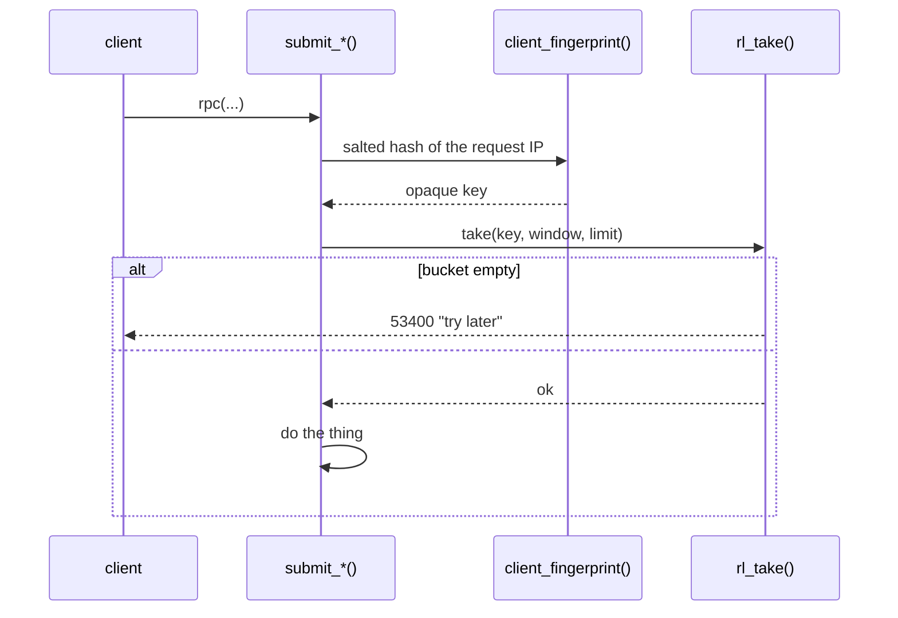

# Who may write what

The anon key is in the bundle. Anybody can read it, and it authorises nothing —
that is the design, not a leak. Every restriction is in the database.

There are three layers, and you need to understand that they are **not
interchangeable**, because confusing them is how this codebase shipped a real
hole.



| layer | asks | answers |
| --- | --- | --- |
| **schema usage** | may this role see this schema at all? | `permission denied for schema` |
| **grant** | may this role touch this table at all? | `permission denied for table` |
| **RLS policy** | may this role touch *this row*? | `violates row-level security policy` |
| **function** | neither — `security definer` runs as the owner | its own rules |

All three refusals are error code **42501**. That collision is not academic;
see the advanced block below.

The schema layer is new, and it arrived with a lesson attached. When this app's
tables were carried into `restroom`, the import brought tables, types,
functions, views, indexes, policies and triggers — and **no `GRANT` statements
at all**. Every RLS policy was present and correct, and the app could not read
a single row. A policy cannot help a role that may not reach the table, and a
role that may not reach the schema never gets as far as the table. Migration
028 is the repair.

## The rule

> **A table with a `submit_*` function in front of it has no write grant.**

The function is the door, and its rate limits are not optional. There is
exactly one exception, and it is written down in
[`scripts/tests/grants.test.mjs`](../scripts/tests/grants.test.mjs) rather than
left to be discovered:

| table | grant | why |
| --- | --- | --- |
| `comments` | INSERT, DELETE to authenticated | the client really does write here directly, so its policy is the access control |
| everything else | none | a function owns it |

The list of tables that test covers got shorter with the move to a shared
database: `flags`, `feedback` and `profiles` are the shared layer's now, and its
migrations own their grants and their tests. What `grants.test.mjs` checks is
what this app actually owns — `bathrooms`, `bathroom_codes`, `reports` and
`access_claims`, plus the `comments` exception. The rule did not change; the
list of things it applies to here did.

`profiles` is read-only to the API roles too — `SELECT` and nothing else,
verified live. Its display name is derived by the signup trigger and there is
no function to change it, so an editor means adding `set_display_name()` in the
shared layer and granting execute on **that**, not restoring the table grant.

<details>
<summary><b>Advanced</b> — the rule is currently broken, in a way nothing can reach</summary>

Migration 028 re-granted everything after the move, from a generated list, and
that list is wider than the hand-written one it replaced. Every table in
`restroom` now carries `TRUNCATE`, `REFERENCES`, `TRIGGER` and `MAINTAIN` for
`anon` and `authenticated`, including the four the rule above is about. The
file it effectively replaced, `20260911000004_grants.sql`, granted `select`,
`insert` and `delete` and nothing else, each one with a comment saying why.

TRUNCATE is a write grant on a table whose entire design is that only a
function may write to it.

It is not reachable today: PostgREST maps HTTP onto SELECT, INSERT, UPDATE,
DELETE and RPC, and never issues a TRUNCATE. So this is not the `flags` hole
below repeating itself — there is no request that gets there. It is a privilege
nobody decided to grant, sitting on the tables most carefully closed, and it
stayed invisible because `grants.test.mjs` filters
`privilege_type in ('INSERT','UPDATE','DELETE')` and TRUNCATE is not one of the
three.

Two repairs, and the second is the one that lasts: revoke the four, and make
the test an **allowlist** — "nothing but SELECT, plus the listed exceptions" —
so the next generated grant list cannot quietly add a fifth.

</details>

<details>
<summary><b>Advanced</b> — the hole this rule came from</summary>

`flags` carried `INSERT` for anon and authenticated, next to an RLS policy
asking only that `reporter_id` be null. `submit_flag()` limits to ten a day per
fingerprint — and a client could skip it entirely by posting to the table,
anonymously and without bound. On the table that receives takedown requests.

It survived because two rules that both *looked* like access control were
sitting there, and neither checked the thing that mattered.

It was verified rather than assumed, by restoring the grant and policy inside a
transaction and rolling back:

```
with the fix in place:     refused (42501)
with the grant restored:   INSERTED
```

Three more tables had the same shape and were closed in the same pass:
`reports` (both rate limits skippable), `bathrooms` (the 20m duplicate check),
`bathroom_codes` (the supersede logic). None was as bad — each policy bound the
row to the account writing it, and two carried real limits — but all four were
doors nothing used.

**The trap when testing this.** A missing grant and a policy refusal are both
42501. A test that asserts only the code passes against the broken schema if
its insert would have failed the old policy anyway — which an insert leaving
`user_id` null certainly would. Assert the **message**: `permission denied for
table` is the grant; `violates row-level security policy` is RLS.

And a permission test must use `t.asRole('anon', …)`. `t.become(user)` sets the
JWT claims but leaves the connection as the owner, which bypasses grants and
RLS entirely, so the test passes no matter what the schema says.

</details>

## Rate limiting

Everything that writes takes a token first.



| function | window | limit | bucket key |
| --- | --- | --- | --- |
| `submit_report` | 1 hour | 40 | `ip:<fp>` |
| `submit_report`, per place and kind | 1 day | 1 | `rpt:<fp>:<place>:<kind>` |
| `submit_bathroom` | 1 day | 5 (in the RLS policy, via `daily_submissions`) | — |
| `submit_access_claim` | 1 hour | 60 | `claim:<fp>` |
| `public.submit_flag` | 1 day | 10 | `restroom-map:flag:<fp>` |
| `public.submit_feedback` | 1 day | 5 | `restroom-map:feedback:<fp>` |

`client_fingerprint()`, `rl_take()` and the `rate_limit` table are all in the
shared layer now, which makes the last column worth reading. The two shared
functions namespace their key by the calling app; this app's own functions,
written when it was alone in the database, do not. Nothing collides today —
`ip:`, `claim:` and `rpt:` are shapes no other app uses yet — but **a new
limit should take an app-prefixed key**, because the table is one table and the
failure would be one app silently spending another's allowance.

All three are **revoked from the API roles**, so a client cannot read or spend
somebody else's bucket. The salt lives in `rl_salt()`, which they also cannot
execute.

<details>
<summary><b>Advanced</b> — why the fingerprint is a hash and what it costs</summary>

The privacy page promises that no location history exists and that the network
address is kept only as a salted one-way hash used as a counter. That is
literally true: `rate_limit` holds a key, a count and a window, and the key
cannot be reversed to an address.

The cost is that a shared address — an office, a campus, a phone network's
CGNAT — shares a bucket. The limits are set generously enough that this does
not bite in practice: five feedback messages a day and forty reports an hour is
far more than one person produces and far less than a flood.

Anonymous writes carry an `anon_id` on `reports`, which is how
`trouble_reporters_90d` counts distinct people without an account. It is a
per-browser value, so it is defeatable — which is exactly why auto-hide needs
*three* of them plus a score threshold rather than trusting any one.

</details>

## What is public and what is not

| public | not public |
| --- | --- |
| places, their accessibility fields, notes, display names | your email address |
| whether a place has a code | the code itself, unless you may see it |
| report counts and freshness | who reported what |
| | credit balance and history |
| | which codes you have unlocked |
| | anything sent through the feedback form |

Codes are gated in the database, not the client: `get_code` returns
`{ code: null, locked: true, cost: 2 }` to somebody who has not unlocked one.
The client never receives a value it is not allowed to render.

<details>
<summary><b>Advanced</b> — the report box is not a public wall</summary>

`flags` and `feedback` have **no SELECT grant at all**, for any API role. A
client cannot read them back, and the refusal is `permission denied` rather
than an empty result — a stronger answer than a policy returning zero rows,
because there is no policy to get wrong.

The moderation queue is reachable only as the owner, which is how `db.mjs`
connects. `service_role` has no grant on those tables either; nothing in this
project runs as `service_role`.

</details>

## Things not to do

- **Do not add a write grant** to a table with a `submit_*` function. The test
  in `grants.test.mjs` will fail, and it is right.
- **Do not drop or rename an RPC parameter.** PostgREST resolves by argument
  name and a cached service worker is still calling the old shape. Adding a
  parameter with a default is safe.
- **Do not put a secret in the client.** There is nowhere to put one.
- **Do not commit `.env`.** It holds the database password, which bypasses RLS
  entirely. It is gitignored; keep it that way.
- **Do not grant anything on `public`.** That schema belongs to the shared
  layer and to every other app in the database — see
  [shared-database.md](shared-database.md). A grant made here for this app's
  convenience is a grant made on everybody's accounts table.
- **Do not query `flags` or `feedback` without `app = 'restroom-map'`.** Not a
  privilege question but the same shape of mistake: the rows of several apps
  are in one table, and reading all of them is one forgotten predicate away.
