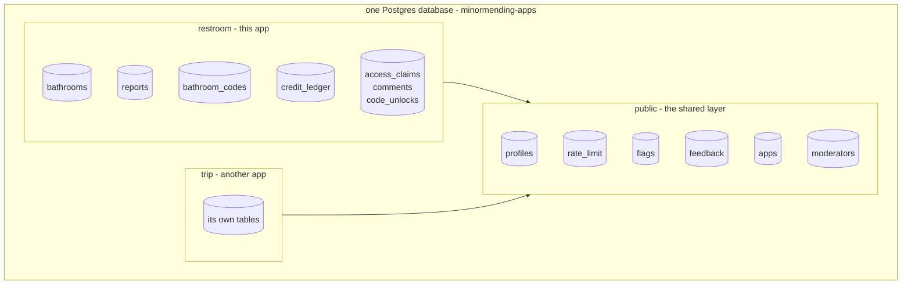
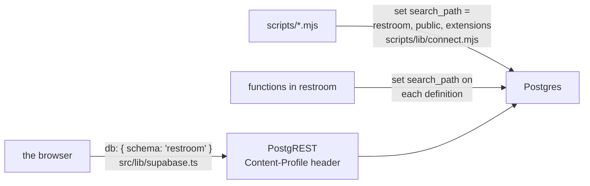
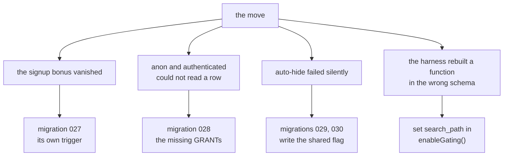

# The database is shared

This app no longer has a database to itself. It owns the **`restroom` schema**
of a database shared with other apps, over a **`public` layer** holding the
things every app needs one of: accounts, rate limiting, and the queue a person
reads.

That happened on 21 September 2026, in one commit, and it is the single
largest change the schema has had. Most of this document exists because the
move broke four things that reading the diff would not have shown.



The arrow is real: `credit_ledger` references `public.profiles(id)`, and every
`submit_*` function in `restroom` takes a rate-limit token from
`public.rl_take()`. This app depends on the shared layer. The shared layer
knows nothing about this app.

**The arrangement itself — how it works, how to add an app, how to move one in
— is [map-kit's runbook](https://github.com/minormending/map-kit/blob/main/docs/SHARED-DATABASE.md).**
That is the shared knowledge and it lives with the shared code. What follows is
only what is true of *this* tenant.

## What moved and what did not

Its 1,070 bathrooms came across. Its own profiles, flags, feedback and
`rate_limit` did not — the shared layer already had them, and having two of
each is the collision the arrangement exists to avoid.

| | where it lives now | owned by |
| --- | --- | --- |
| `bathrooms`, `reports`, `bathroom_codes`, `code_unlocks` | `restroom` | this repo |
| `access_claims`, `comments`, `credit_ledger` | `restroom` | this repo |
| `bathroom_confidence`, `access_claim_state`, `user_credits` | `restroom` | this repo |
| `moderation_queue` | `restroom` | this repo, but reads shared rows |
| `profiles` | `public` | the shared layer |
| `flags`, `feedback` | `public` | the shared layer |
| `rate_limit`, `apps`, `moderators` | `public` | the shared layer |

Nineteen functions are in `restroom` and seven are in `public`. The seven are
the ones every app calls: `submit_flag`, `submit_feedback`,
`client_fingerprint`, `rl_take`, `rl_salt`, `is_moderator`, `handle_new_user`.

`restroom.moderation_queue` is the interesting row in that table. It is this
app's view, but it selects from the shared `flags` and `feedback` with
`where app = 'restroom-map'` on both halves of its union. So `pnpm db:queue`
shows this app's queue and not somebody else's, and it does the `message as
reason` aliasing that keeps the older callers reading the way they always did.

## How each caller gets the right schema

There are three kinds of caller and each is told once, in one place.



**The browser** sets `db.schema` when it builds the client. supabase-js turns
that into an `Accept-Profile` header on reads and a `Content-Profile` header on
every `rpc()`, and PostgREST resolves strictly inside that schema — it does not
fall back to `public`. The client's type is inferred from the factory now
rather than annotated, because a bare `SupabaseClient` is the public-schema one
and no longer describes this.

**Scripts** get it from `withClient`, which sets the search path once for every
connection. Setting it there rather than per script is also what keeps
`schema_migrations` in `restroom`: map-kit's runner creates that table
unqualified, so it lands wherever the search path points, and every app in this
database numbers its migrations from `0001`.

**Functions** carry their own `set search_path` on the definition, which is
what lets the body say `bathrooms` and `rl_take()` in the same statement and
have both resolve.

<details>
<summary><b>Advanced</b> — two callers are still pointing at the wrong schema</summary>

Both are live as of 22 September 2026, and both are the same mistake in
different clothes: a caller that was correct when everything was in one schema.

**The feedback and flag forms do not work.** `sendFeedback` and `submitFlag`
call `supabase.rpc('submit_feedback' | 'submit_flag')` on the client configured
for `restroom` — so PostgREST looks for `restroom.submit_feedback`, which does
not exist, and answers `PGRST202`. The functions are shared and live only in
`public`. The fix is `supabase.schema('public').rpc(…)` for those two calls.

Nothing in the database suite catches it, which is the part worth
understanding. `feedback.test.mjs`, `flags.test.mjs` and `grants.test.mjs` all
call these functions as raw SQL over a connection whose search path already
includes `public`, so they resolve and pass. The database is fine. It is the
client's routing that is broken, and no test exercises a call the way the
browser makes it.

**`node scripts/db.mjs triage` errors out** with `column g.reason does not
exist` — it selects the old column name from what is now the shared table. When
that is fixed it will also need `where app = 'restroom-map'` on both halves,
which it does not have: without it, the daily triage run would read
trip-companion's queue and open pull requests about it here.

`pnpm db:queue` is unaffected, because it goes through `moderation_queue`,
which already does both things right.

</details>

## The parameters changed, and one of them is a trap

The two shared write functions take an extra argument naming the caller:

```ts
supabase.rpc('submit_feedback', {
  p_app: 'restroom-map',   // which app is asking
  p_kind: kind,
  p_message: message,      // NOT p_reason
  …
})
```

`p_message` rather than `p_reason` is not a cosmetic rename. This app predates
map-kit; the kit was extracted *from* it, and the column was renamed on the way
out. So the old name is the one that reads as correct and the new one is the
one that works — which is the shape of mistake that survives review.

Every row in `flags` and `feedback` carries its `app`. A query against either
that does not filter on it is reading every app in the database.

## What the move broke

Four things, none of them visible in the diff, all four caught by running
`pnpm test` afterwards. They are worth keeping because each one is a general
shape rather than a one-off.



**The signup bonus vanished.** This app's `handle_new_user()` did two jobs:
create the profile and award five credits. The shared one only does the first,
and bolting an award onto it would put one app's economy in the layer the
others use. So the award is now this app's own trigger on the same event,
named `restroom_signup_bonus` — the name is load-bearing, because same-event
triggers fire in alphabetical order and `credit_ledger` references `profiles`,
so it has to sort after `on_auth_user_created`. `'r'` sorts after `'o'`.

**The import carried no grants.** Tables, types, functions, views, indexes,
policies and triggers all came across; `GRANT` statements did not. So `anon`
and `authenticated` had no privileges on anything in `restroom` and the app
could not read a single row. **RLS policies do not help when the role cannot
reach the table at all** — the policies were all there and all correct, and the
answer was still `permission denied`.

**Auto-hide failed silently.** `apply_auto_hide()` still wrote a flag the way
this app's own `flags` table took one. Against the shared table that raises, so
the trigger failed, so a place with sustained trouble reports stayed on the map
and the clawback never ran. Nothing looked wrong from outside.

**The harness rebuilt a function in the wrong place.** `t.enableGating()` does
a `create or replace` on `can_view_code` with a hardcoded search path, which
pointed at `public`.

<details>
<summary><b>Advanced</b> — and the canary stopped watching</summary>

That last one has a tail. `schemaFingerprint()` in `scripts/test.mjs` still
hashes `where n.nspname = 'public'`, but every function it exists to protect
moved to `restroom`. Its own error message names `can_view_code()` and
`unlock_cost()`; both are now unhashed, and `enableGating()`'s replacement
lands in `restroom` too.

So the half of the canary that guards against a replaced function body
outliving its rollback is currently watching a schema this app does not write
to. The row-count half still works. See [testing.md](testing.md).

</details>

## Rules

- **Do not add a table to `public`.** It is not this repo's to extend. A new
  shared table is a change to map-kit and `apps-db`, and it lands on every app.
- **Filter by `app` on every query against `flags` or `feedback`.** The rows of
  two apps are in one table and nothing in the types will remind you.
- **Qualify `public.` explicitly when you mean the shared thing.** The search
  path makes the unqualified name work today; it makes it work *silently*, and
  the reader cannot tell which layer a line is talking about.
- **Reach shared functions from the browser with `supabase.schema('public')`.**
  The default client is the `restroom` one, on purpose.
- **Migrate the shared layer first** in a new database. `restroom` references
  `profiles`, `rate_limit` and `apps`, so it cannot be applied before them.
