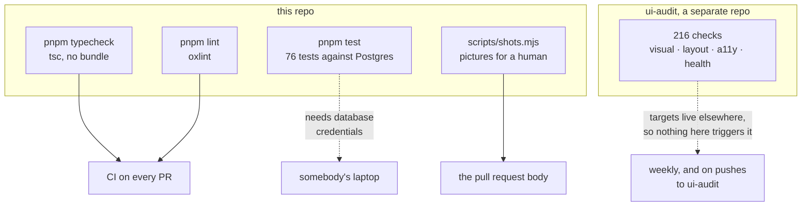
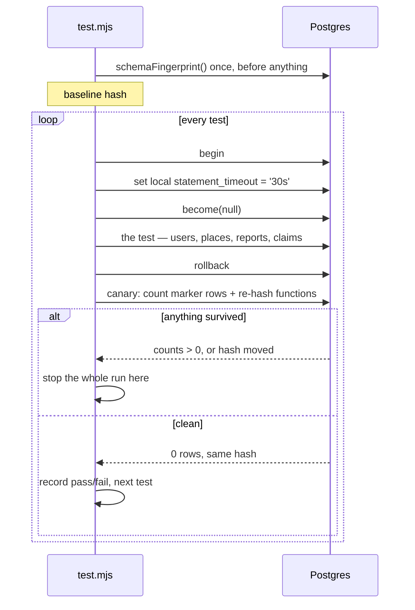
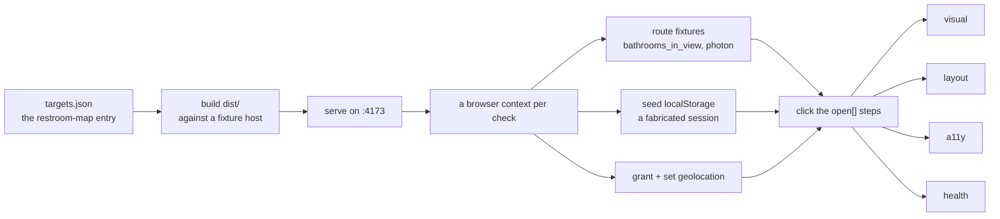

# How this is tested

Four systems, and they do not overlap. Two of them do not run in CI, which is
the first thing to know about them.



| | catches | where it runs |
| --- | --- | --- |
| `pnpm typecheck` / `pnpm lint` | types, dead variables, React footguns | CI, every PR |
| `pnpm test` | the database: credits, codes, claims, grants, rate limits | a laptop with `.env` |
| ui-audit | contrast, overflow, tap targets, console errors, pixel drift | the other repo, weekly |
| `scripts/shots.mjs` | nothing — it produces evidence for a person | on demand |

**The gap that matters:** a pull request here runs types, lint and a build.
Neither the database suite nor the UI audit gates a merge. If you change a
Postgres function or a stylesheet, the thing that would catch you is something
you have to run yourself.

---

## 1. The database suite

```bash
pnpm test                          # every suite
pnpm test credits                  # suites whose name contains "credits"
node scripts/test.mjs --verbose    # list passing tests too
```

**76 tests in 8 suites**, across seven files in `scripts/tests/`.

### Why it runs against the real database

The things worth testing here are not JavaScript. They are Postgres functions —
`submit_bathroom`, `unlock_code`, `can_view_code`, the award and auto-hide
triggers — sitting on PostGIS and Supabase's `auth` schema. There is no local
Postgres on this project and no container runtime, so a mock would be the only
thing under test.

So the suite connects to the project database. Yes, the one the live site reads.

### What makes that safe

Every test runs inside a transaction that is **always rolled back** — on pass,
on failure, on assertion error, and on the process being killed, where the
connection drops and Postgres does it without being asked. There is no `commit`
anywhere in the runner.

That is the design. The enforcement is a **canary** that runs after every single
rollback:



Tests never touch rows that already exist. They mint their own users and
places, and the places sit at Null Island (lat `n * 0.002`, lng `0`) so
`submit_bathroom`'s 20-metre duplicate check cannot collide with anything real.
Every row a test creates carries the marker `harness.invalid`, which is what the
canary hunts for.

<details>
<summary><b>Advanced</b> — the canary is two checks, and it needs both</summary>

```js
// scripts/test.mjs
const MARKER = 'harness.invalid'
```

**Half one: row counts.** Users whose email ends `@harness.invalid`, bathrooms
named `TEST/harness.invalid/%`, and bathrooms with `import_source =
'test-harness'`. Any of them above zero and the run stops.

**Half two: a schema fingerprint.** An md5 of `pg_get_functiondef` across every
function in `public`, ordered by oid, taken once before the run and re-compared
after every rollback.

Neither is redundant. The counts alone would miss a *function body* left behind
— and one test deliberately replaces one. `t.enableGating()` re-installs the M4
body of `can_view_code()` inside its transaction, because migration 013 opened
codes back up and a lever nobody ever pulls is a lever nobody knows is broken.
If that replacement ever outlived its rollback it would put a paywall on every
code on the live map, and nothing would visibly break.

The hash alone would miss data, and it would also miss a migration applied by
another process mid-run — which is possible, because this is pointed at the
database a person might be migrating from another terminal.

</details>

### The eight suites

| suite | file | tests | what it pins down |
| --- | --- | --- | --- |
| `harness` | `harness.test.mjs` | 5 | that the test kit itself does what it claims |
| `credits` | `credits.test.mjs` | 19 | the ledger — escrow, signup bonus, clawbacks, the daily trickle |
| `codes` | `codes.test.mjs` | 16 | `can_view_code`, unlock pricing, paying twice, reading others' unlocks |
| `access claims` | `access.test.mjs` | 13 | how two people agreeing turns an answer into a fact |
| `hours` | `access.test.mjs` | 3 | opening hours as a claim like any other |
| `feedback` | `feedback.test.mjs` | 9 | the complaint path, its rate limit and its privacy |
| `flags` | `flags.test.mjs` | 7 | takedown requests, and that nobody can read the queue |
| `write grants` | `grants.test.mjs` | 4 | that every table with a submit function refuses writes from outside it |

Read `harness.test.mjs` first. It is five tests and it explains the kit.

### Writing one

```js
import { suite, eq } from '../lib/testkit.mjs'

suite('credits', (test) => {
  test('signing up is worth five credits, once', async (t) => {
    const user = await t.newUser()
    eq(await t.balance(user), 5, 'the signup bonus')
  })
})
```

The `t` handed to each test is the whole API:

| | |
| --- | --- |
| `t.sql` / `t.one` / `t.val` | rows, first row, first column |
| `t.newUser({ ageDays, name })` | a real signup — `auth.users` insert, real trigger, real bonus |
| `t.anonVisitor()` | somebody with no account, from their own IP |
| `t.as(who, fn)` | run `fn` as that caller |
| `t.place({ owner, code, venue, access })` | a place, through `submit_bathroom` if it has an owner |
| `t.report(who, place, kind, { geo })` | a report through the real RPC |
| `t.balance` / `t.ledger` / `t.entries` | read the credit ledger |
| `t.raises(fn, errcode)` | assert a failure, and assert *which* failure |
| `t.asRole(role, fn)` | run as a database role rather than as a user |

Two defaults worth knowing. `newUser` makes accounts **two days old**, because
escrow only counts confirmations from accounts older than a day — pass
`ageDays: 0` for a sockpuppet minted this morning. And every caller gets its own
IP (`198.51.100.n`), because every rate limit in the schema is keyed on
`client_fingerprint()`; without that, all test users would share one bucket and
the third confirmation of anything would be refused.

<details>
<summary><b>Advanced</b> — <code>become()</code> and <code>asRole()</code> are not the same, and the wrong one passes</summary>

This is the trap that costs an afternoon.

`t.as(who, …)` calls `t.become(who)`, which sets two things:

```js
set_config('request.jwt.claims', {"sub": …, "role": "authenticated"}, true)
set_config('request.headers',    {"cf-connecting-ip": …},             true)
```

That changes what `auth.uid()` returns and what `client_fingerprint()` sees. It
does **not** change the database role. The connection is still the owner, which
bypasses RLS and table grants entirely.

So a test that checks "anon cannot insert into `credit_ledger`" and uses
`t.as(anonVisitor(), …)` **passes against a completely open schema**. It proves
nothing. That is why `grants.test.mjs` exists and why it uses `t.asRole`:

```js
await t.asRole('anon', () => t.raises(
  () => t.sql(`insert into credit_ledger …`), '42501'))
```

`asRole` does `set local role anon`, which is the only way to exercise a policy
or a grant. Rule of thumb: **testing a rule the application enforces → `as`.
Testing a rule the database enforces → `asRole`.**

</details>

<details>
<summary><b>Advanced</b> — savepoints, and the aborted-transaction error that hides the real one</summary>

In Postgres a raised error aborts the whole transaction. Every statement after
it fails with `25P02 current transaction is aborted`, including the ones the
test kit runs to tidy up.

Two places deal with this.

`t.raises` wraps the call in a savepoint and rolls back to it, so the first
expected failure in a test does not take the rest of the test down with it:

```js
await client.query('savepoint expected_failure')
try { return await raises(fn, errcode, what) }
finally { await client.query('rollback to savepoint expected_failure').catch(() => {}) }
```

`t.as` restores the previous caller *without* a plain `finally`. If `fn` threw,
the transaction is aborted and the restoring `set_config` fails too — a plain
`finally` would report that `25P02` instead of the refusal the test was
actually checking. So it captures the failure, attempts the restore with
`.catch(() => {})`, and rethrows the original.

One more thing the assertions do on purpose: `eq` coerces a string actual
against a number expected, because Postgres hands back `bigint` counts and
`numeric` as strings. It lets a test read `eq(balance, 5)` rather than
`eq(balance, '5')`.

And `raises` takes an **errcode**, not a message. The code is part of the
contract — `src/lib/` keys its user-facing messages off them — so a function
that starts raising a different code is a break even when the English is
identical.

</details>

<details>
<summary><b>Advanced</b> — what the suite deliberately does not cover</summary>

Two sessions racing the same balance. `unlock_code()` locks the buyer's profile
row before reading it, but proving that needs a second session that can *see*
the buyer — which needs a commit, and nothing here commits.

The suite covers what the lock protects. It does not cover the race the lock
exists to prevent. That is a known hole, not an oversight.

</details>

---

## 2. The UI audit

Visual, layout, accessibility and console checks live in **`ui-audit`**, a
separate repo that clones this one and runs against a build of it. Auditing is
centralised there rather than copied into each project, because one place then
owns the checks, the baselines and the Playwright version.

```bash
# from the ui-audit checkout, not this one
npm run build:targets restroom-map
AUDIT_ONLY=restroom-map npx playwright test
```

**216 checks: 18 registered states × 3 viewports × 4 kinds.**



| check | what it asserts | needs a baseline? |
| --- | --- | --- |
| `visual` | no pixel has moved since an approved screenshot | yes |
| `layout` | no horizontal page scroll, nothing past the viewport, no container clipping its own content, no tap target under 24×24 (WCAG 2.2 SC 2.5.8) | no |
| `a11y` | axe-core at `wcag2a`, `wcag2aa`, `wcag21a`, `wcag21aa` — contrast, ARIA misuse, unlabelled controls | no |
| `health` | no failed requests or 404s, no console errors, and the page has a `<title>`, a `lang`, a viewport meta and at least one `h1` | no |

Viewports: desktop 1280×800, tablet (iPad gen 7), mobile (iPhone 13).

The three that need no baseline are the interesting ones. A visual diff only
tells you something *changed*; those three tell you something is *wrong* on a
screen nobody has ever looked at.

### Registering a screen is work, and unregistered screens have no coverage

Almost nothing in this app has a URL of its own. The map, the filters panel, the
detail sheet, the add-a-place flow and the menu are all one route with things
layered over it — so the audit reaches them by **clicking**, and a screen nobody
has written the clicks for is simply not tested.

That is not hypothetical. Adding the states behind a click to the other audited
projects turned a clean run into thirty new failures.

<details>
<summary><b>Advanced</b> — the three keys that make this target reachable at all</summary>

This project is built for the audit against a Supabase host that does not exist
(`https://fixture.supabase.co`), so nothing can reach live data. Three keys in
its `targets.json` entry put the app into a usable state anyway:

**`fixtures`** — routes intercepted and answered from disk.
`**/rest/v1/rpc/bathrooms_in_view` returns a fixed set of places,
`**photon.komoot.io/**` answers the address search, and anything else on
`*.supabase.co` gets `[]`.

**`storage`** — `localStorage` seeded before the first script runs, with a
fabricated `sb-fixture-auth-token`. supabase-js keys its storage on the host,
hence the `sb-fixture-` prefix. This is what makes the signed-in, add-a-place
and account screens photographable at all.

**`geolocation`** — granted *and* positioned before navigation. Granting without
setting a position hands the page a request that never resolves, which looks
exactly like a refusal until you read the trace. The coordinates have to sit on
top of something in the fixture: the nearby prompt only appears within 60m of a
place it already knows about, and only when the fix is accurate to 40m.

A trap worth knowing: `ui-audit`'s own `scripts/capture.js` — the screenshot
helper behind its design-review flow — reads `open`, `waitFor` and `path`, but
**not** these three. Pointed at this project it waits on `.banner-count`, which
never appears without the fixtures, and times out on every application state.
It captures `privacy` and `terms` and nothing else.

</details>

<details>
<summary><b>Advanced</b> — baselines are per-platform, and that is a two-file commit</summary>

macOS writes `*-darwin.png`; CI needs `*-linux.png`. Both are committed in
`ui-audit`, under `checks/visual.spec.js-snapshots/`.

Approving an intentional visual change is therefore two steps:

```bash
npm run test:update                            # darwin, locally
gh workflow run baselines.yml -f only=restroom-map   # linux, in CI
```

The tolerance is `maxDiffPixels: 40` — an absolute budget, not a ratio. A ratio
scales with viewport area, so the same change that failed on a 390×844 phone
passed on a 1280×800 desktop; the biggest screens were the least sensitive, and
a changed word registered on none of them.

</details>

### What the audit cannot see

It measures rules. It cannot tell you a screen looks wrong. And it can only
measure the screens somebody has registered.

The worked example is recent, and it is kept here in the order it happened
because the order is the lesson.

`.place-list` was pinned with a hard-coded `inset: 3.4rem 0 0` while the top
bar's clearance lives in `--below-bar`, which grows to `7rem` when the bar wraps
to two rows. Signed in at phone width, 50.1px of the list — the whole first
card — sat behind the toolbar. **The audit was green through all of it**, for a
dull reason: `targets.json` registered no list state. The twelve screens under
test were the map, its sheets and the two legal pages. It was found by eye, in a
pass over screenshots of states the registry did not cover.

Three more were found the same way and stayed green the same way: the list
rendering 1256px wide on a desktop, one sentence styled three different ways,
and a sign-in warning covering 83% of the banner behind it.

Then the six missing screens were registered — `list`, `detail`, `flag-form`,
`code-form`, `sign-in-warning`, `account-menu` — and **the first run found two
more, immediately**, both serious contrast failures that had been shipping the
whole time:

| | |
| --- | --- |
| `.sheet-kind` | a fill colour used as 0.7rem type, worst at **3.13:1**. Five of eight kind/theme combinations failed, and the dark-mode half could never have passed: the colour came from an inline style, which is one value for both themes |
| `.confidence.tone-unknown` | `--ink-3`, tuned to 4.77:1 on white, on a tinted surface — 4.44:1 light and 4.32:1 dark |

Twelve screens became eighteen; 144 checks became 216.

So, two things, and the second is the one that costs people:

- When something looks wrong, trust that over a green run.
- **If you add a screen, register it.** An unregistered screen is not
  "untested" in a way anybody notices — it is a screen the suite reports as
  fine.

---

## 3. Pictures for a reviewer

`scripts/shots.mjs` photographs fifteen named states against fixtures;
`scripts/pr-shots.mjs` does the same on both sides of a branch and publishes
only what changed.

```bash
node scripts/shots.mjs                        # every state → shots/
node scripts/shots.mjs menu feedback          # just those
node scripts/shots.mjs --out before --width 1280
node scripts/pr-shots.mjs --dry-run code-form # capture and diff, publish nothing
```

These test nothing. They produce evidence for a person, because a reviewer
looking at a CSS diff cannot tell whether it is right. **[triage.md](triage.md)
covers how they work and the two things that are easy to get wrong.**

Worth knowing that this is a *different* state list from the audit's, and a
longer one: `shots.mjs` reaches `list`, `detail`, `flag-form`, `code-form`,
`sign-in-warning` and `account-menu`, none of which `targets.json` registers.

---

## 4. Types and lint

```bash
pnpm typecheck    # tsc --noEmit -p tsconfig.app.json
pnpm lint         # oxlint
```

Both gate every pull request, along with a build using the same base path Pages
will serve from. `oxlint` currently reports **six warnings and no errors** —
four `react(set-state-in-effect)`, one `react(only-export-components)` and one
unused variable in an import script. They are pre-existing, and a warning does
not fail the job.

<details>
<summary><b>Advanced</b> — what CI actually guards</summary>

`.github/workflows/ci.yml`, job `check`, on `pull_request`: install, typecheck,
lint, build. That is all of it.

The build step matters more than it looks — it is the same build Pages gets,
with `BASE_PATH` derived the way `deploy.yml` derives it, so a bundle that
cannot be produced fails at review rather than after the merge that deploys it.
The Supabase values passed in are the public ones: a build needs them
*present*, not valid.

Nothing here runs `pnpm test`, because that needs database credentials CI does
not have. Nothing here runs the audit either — `ui-audit` clones its targets, so
a push to this repo triggers nothing there. Its weekly schedule exists precisely
for that reason, which means a regression this repo introduces can sit green for
up to a week.

</details>

---

## What nothing covers

Say it plainly, so nobody assumes otherwise:

- **No frontend unit tests.** There is no vitest, no jest, no testing-library.
  Every component is covered only by the audit looking at it and a person
  looking at a screenshot.
- **No end-to-end test of a real write.** The database suite exercises the RPCs
  directly; the audit runs against fixtures and can never reach the real
  database. Nothing drives a browser through a genuine submission.
- **The concurrency guard in `unlock_code()`**, for the reason in the fold above.
- **Anything on a screen nobody has registered**, in either tool.
