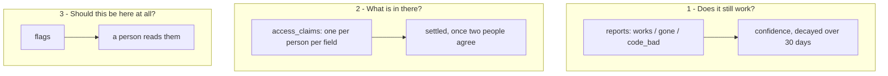
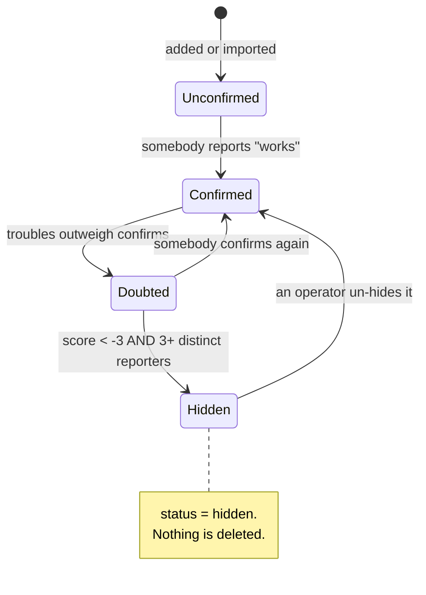
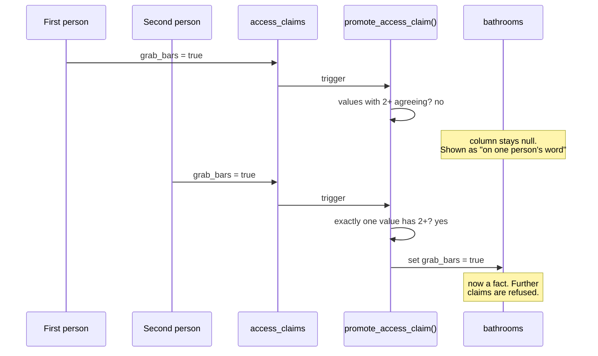
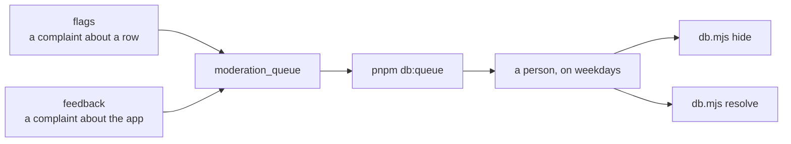
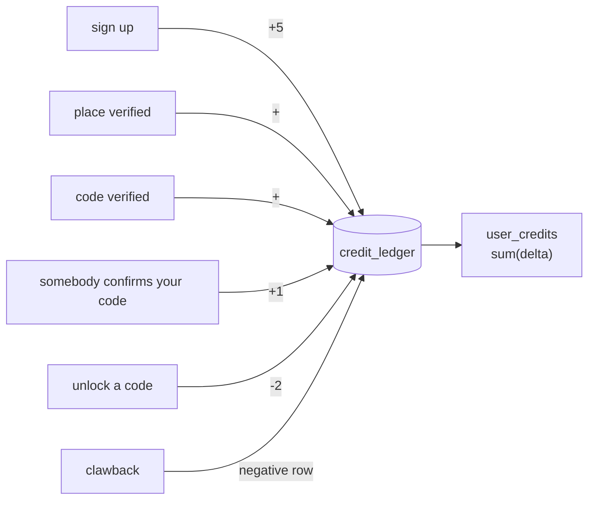

# How something becomes a fact

This is the part of the codebase worth understanding before you change
anything. Everything else is plumbing around it.

The app tells somebody a restroom has grab bars. They cross a city on that.
There is no staff, no inspection, no way to check — so the only thing standing
between a sentence on a screen and a wasted trip is how carefully this decides
what to say.

There are **three separate mechanisms**, and they are separate on purpose.



They answer different questions and they fail differently, which is why none of
them is built on the others.

## 1. Does it still work?

Anybody can report — no account needed. The report is `works`, `gone`,
`code_bad`, `inaccessible` or `dirty`, and what it buys you is a sentence on
the detail sheet:

> Confirmed working 2 days ago by 3 people.



**Freshness first.** A stale confirmation is worth less than a new one, so the
score decays with a thirty-day half-life and the sentence leads with *when*.

**Auto-hide needs three distinct people, not three reports.** One person with a
grudge and a browser toggle is two addresses. Three separate people saying a
place is gone is a signal; one person saying it six times is not.

<details>
<summary><b>Advanced</b> — the numbers and where they are</summary>

`apply_auto_hide` (migration 007) fires as a trigger on `reports` and hides a
place when **both** hold:

```sql
score < -3  and  trouble_reporters_90d >= 3
```

`score` is in `bathroom_confidence`: `works` counts `+1`, everything else
counts `-2`, each multiplied by `exp(-age_seconds / 2592000.0)`.

Trouble counting double is deliberate asymmetry. A false "it works" costs
somebody a wasted trip; a false "it's gone" costs a pin that a person can
restore. The cheaper mistake gets the lighter weight.

Hiding is a soft delete — `status = 'hidden'`, the reports and notes survive,
and `db.mjs unhide <id>` reverses it. The hide also writes a resolved flag, so
the reason is on the record.

Geo-verification: `submit_report` takes coordinates, computes
`st_dwithin(geog, point, 150)`, stores the **boolean**, and discards the
position. The 150m radius is right for "were you plausibly there" after the
fact; it is much too loose to name a place unprompted, which is why the nearby
prompt uses 60m with a 40m accuracy requirement instead.

</details>

## 2. What is in there?

This is the mechanism the project exists for, and the rule is short:

> **Two people who independently give the same answer settle a field. One
> person is an account, not a fact.**



Three consequences a junior developer will meet:

1. **The cold start is hard on purpose.** The first person to record a hoist
   sees their answer sit as unconfirmed until somebody else visits the same
   restroom. That is the rule working, not a bug.
2. **Claims are fill-only.** Once a field is settled, `submit_access_claim`
   returns `already_settled` and refuses. Correcting a settled fact has no
   design yet — it is on the launch list.
3. **Disagreement settles nothing.** Two people saying `true` and two saying
   `false` leaves the column empty, and the sheet shows it as disputed.

<details>
<summary><b>Advanced</b> — the trigger, and the dynamic SQL in it</summary>

`promote_access_claim` (migration 019, amended by 020) runs after every insert
or update on `access_claims`:

```sql
select count(*), min(value) into v_winners, v_winner
from (
  select value from access_claims
  where bathroom_id = NEW.bathroom_id and field = NEW.field
  group by value having count(*) >= 2
) agreed;

if v_winners = 1 then
  execute format(
    'update bathrooms set %I = $1::%s where id = $2 and %I is null',
    NEW.field, <type for that field>, NEW.field)
  using v_winner, NEW.bathroom_id;
end if;
```

Three things are load-bearing:

- `v_winners = 1`, not `>= 1`. If two values each reach two people, that is a
  disagreement and nothing settles.
- `and %I is null` in the update. A settled field is never overwritten, even by
  a race.
- `format(%I)` with the field name, because the column varies. This is the one
  place in the schema using dynamic SQL, and the field name comes from an enum
  rather than from the client, so it cannot be anything else.

The primary key `(bathroom_id, field, user_id)` is what stops one person voting
twice; a second claim from the same person is an upsert of their own answer.

`access_claim_state` excludes settled fields **by design** — the view exists to
show what is still unresolved, and the settled value is on `bathrooms` itself.

</details>

### Where the values come from

Nothing else. No dataset carries these six fields — not NYC Open Data, not NYC
Parks, not Refuge Restrooms, not OpenStreetMap. That was checked empirically
rather than assumed, and it is the reason the project exists. The imports fill
name, location, wheelchair access, changing tables and gender-neutral; the
six that matter most can only be walked to.

## 3. Should this be here at all?

Flags and feedback go to a queue a person reads.



Anything carrying a contact address sorts to the top, because somebody is
waiting on an answer. Business-removal requests arrive through the same door.

## Credits, and why they exist

Door codes are the one thing worth paying for, so they are gated: **2 credits**
to unlock one you did not contribute.



The ledger is **append-only**. No `update` exists anywhere against it, so a
balance can never disagree with its history and a clawback is a new negative
row rather than an edit of the old one.

<details>
<summary><b>Advanced</b> — escrow, and the constraint that matters most</summary>

The single most important constraint in the schema is the one preventing a
payout being made twice for the same thing: a unique index over
`(user_id, reason, ref_type, ref_id)` on `credit_ledger`. Without it, a
re-fired trigger pays again, and the ledger's whole value is that it cannot.

`can_view_code` decides access without spending: you may see a code for free if
you created the place, submitted the code, or have already unlocked it.
`get_code` returns `{ code: null, locked: true, cost: 2 }` rather than the
code, so the client never receives something it is not allowed to show — the
gate is in the database, not in a conditional render.

`unlock_code` writes the `-2` row and the `code_unlocks` row in one
transaction, so a failure cannot take the credits without granting access.

</details>

## If you change one thing

Read the tests first — `scripts/tests/credits.test.mjs` and
`scripts/tests/access.test.mjs` are the specification, and they are written as
the ways the one-sentence rule can go wrong: the same person counted twice, two
people who disagree, a third who breaks the tie, a field an import already
answered.
